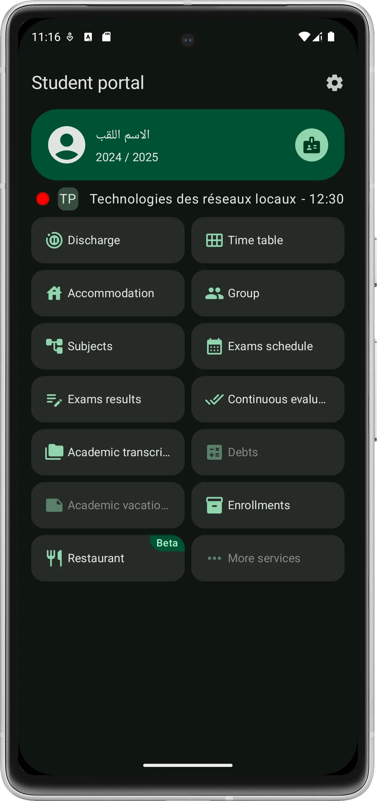

<div align="center">


# [Progres](#)

A remake of the DRDN's Progres WebEtu app.

Made with Kotlin & Compose Multiplatform, for Android 5+ and iOS 10+.

## Some Screenshots

|   |            |       |
|---------------------------------------------------------------------------------------|-------------------------------------------------------------------------------------------|----------------------------------------------------------------------------------------|
|  |  |  |

#### and more

</div>

## Additional Features

- Access your previous years' data
- Material you with dark and light themes
- A more stable experience (as stable as a 3rd party can make it)
- And more coming soon...

## Installation

The application was removed from the Play Store as requested by the ministry of higher education, you can still download the APK from the releases page.

[](https://github.com/abdallahmehiz/progres/releases)

## FAQ

#### Where did you get the API Endpoints?

Intercepting HTTP requests and
the [published API docs in the CodingMasters'2024 hackathon](https://drive.google.com/drive/folders/1jKoRtWpRwU-Bl6LZaobi8KYYIeCd8hBK)

#### Is this app safe to use?

Yes, the app uses the same HTTPS requests calls as the original app to get its data. If you're still
paranoid about it, you can check its source code.

small note: The app collects crash logs, usage analytics and performance metrics with Firebase to help make a better
experience.

## Notes

- The app is not an official supported client for the services of Progres.
- The app was made with no intentions to disrupt or damage Progres or its services.
- This project has was made for educational purposes and is not affiliated with Progres.

## Disclaimer

as per the MIT License, the app is provided without warranty, use at your own risk.

The logos and other intellectual properties also fall under the same license.

## License

```
MIT License

Copyright (c) 2024 Abdallah Mehiz

Permission is hereby granted, free of charge, to any person obtaining a copy
of this software and associated documentation files (the "Software"), to deal
in the Software without restriction, including without limitation the rights
to use, copy, modify, merge, publish, distribute, sublicense, and/or sell
copies of the Software, and to permit persons to whom the Software is
furnished to do so, subject to the following conditions:

The above copyright notice and this permission notice shall be included in all
copies or substantial portions of the Software.

THE SOFTWARE IS PROVIDED "AS IS", WITHOUT WARRANTY OF ANY KIND, EXPRESS OR
IMPLIED, INCLUDING BUT NOT LIMITED TO THE WARRANTIES OF MERCHANTABILITY,
FITNESS FOR A PARTICULAR PURPOSE AND NONINFRINGEMENT. IN NO EVENT SHALL THE
AUTHORS OR COPYRIGHT HOLDERS BE LIABLE FOR ANY CLAIM, DAMAGES OR OTHER
LIABILITY, WHETHER IN AN ACTION OF CONTRACT, TORT OR OTHERWISE, ARISING FROM,
OUT OF OR IN CONNECTION WITH THE SOFTWARE OR THE USE OR OTHER DEALINGS IN THE
SOFTWARE.
```
